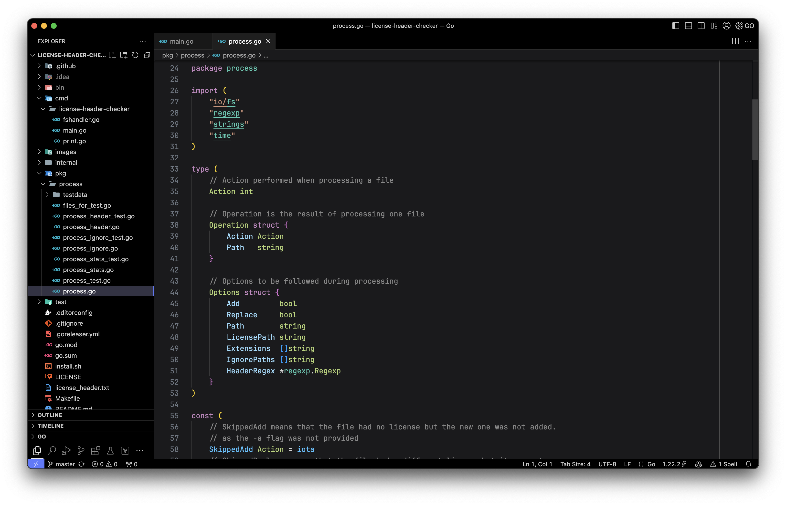

# Black Modern

Black modern is a vscode theme based on the default Dark Modern.

The main UI changes are:
- Black window background
- Slightly different editor background
- Modified accent color

The editor changes are:
- Modified comments from green to gray.
- Modified types color to distinguish from package/namespace.

## Before/After

